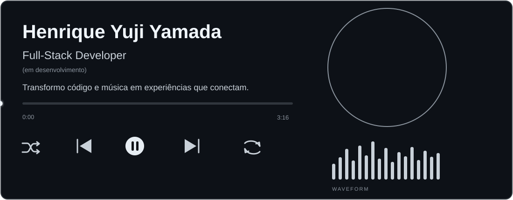
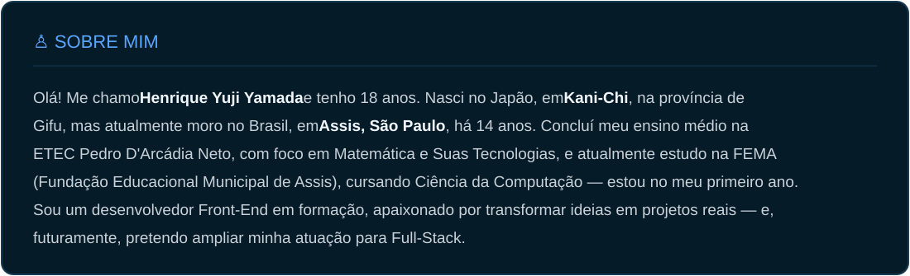
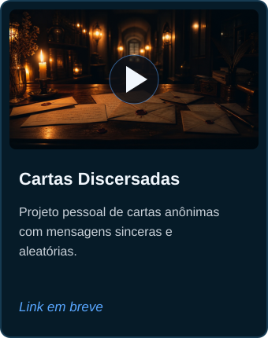
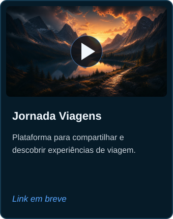
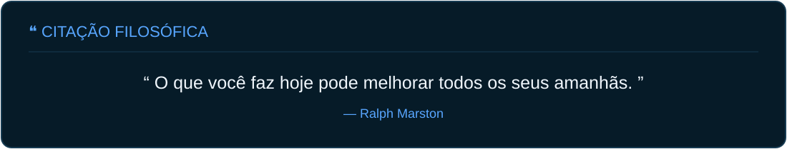
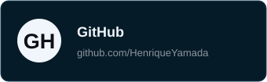

 

## `</>` SKILLS

<table width="100%">
  <tr>
    <td width="50%" align="center">
      <strong>Front-End</strong>  
      
    </td>
    <td width="50%" align="center">
      <strong>Back-End</strong>  
      
    </td>
  </tr>
  <tr>
    <td align="center">
      <strong>Banco de Dados</strong>  
      
    </td>
    <td align="center">
      <strong>Infra</strong>  
      
    </td>
  </tr>
  <tr>
    <td colspan="2" align="center">
      <strong>Ferramentas</strong>  
      
      &nbsp;
      
      
    </td>
  </tr>
</table>

## 📁 PROJETOS EM DESTAQUE

  
  
  

  

## 🐙 GITHUB STATS

  <picture>
    <source media="(prefers-color-scheme: dark)" srcset="https://github-profile-summary-cards.vercel.app/api/cards/stats?username=HenriqueYamada&theme=github_dark">
    <source media="(prefers-color-scheme: light)" srcset="https://github-profile-summary-cards.vercel.app/api/cards/stats?username=HenriqueYamada&theme=github">
    
  </picture>
  <picture>
    <source media="(prefers-color-scheme: dark)" srcset="https://github-profile-summary-cards.vercel.app/api/cards/repos-per-language?username=HenriqueYamada&theme=github_dark">
    <source media="(prefers-color-scheme: light)" srcset="https://github-profile-summary-cards.vercel.app/api/cards/repos-per-language?username=HenriqueYamada&theme=github">
    
  </picture>

## 🐍 CONTRIBUTION SNAKE

  <picture>
    <source media="(prefers-color-scheme: dark)" srcset="https://raw.githubusercontent.com/HenriqueYamada/HenriqueYamada/output/github-contribution-grid-snake-dark.svg">
    <source media="(prefers-color-scheme: light)" srcset="https://raw.githubusercontent.com/HenriqueYamada/HenriqueYamada/output/github-contribution-grid-snake.svg">
    
  </picture>
   
  Contribuindo um commit de cada vez. 🐍

  

## 📡 CONTATOS

  
  &nbsp;&nbsp;
  
  &nbsp;&nbsp;
  

