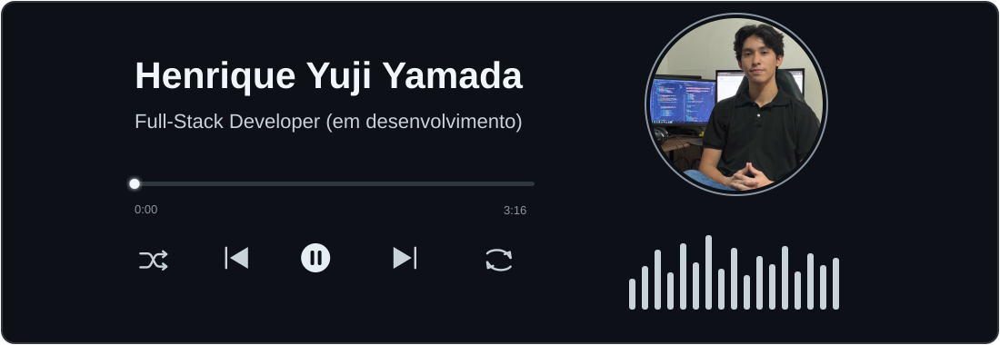
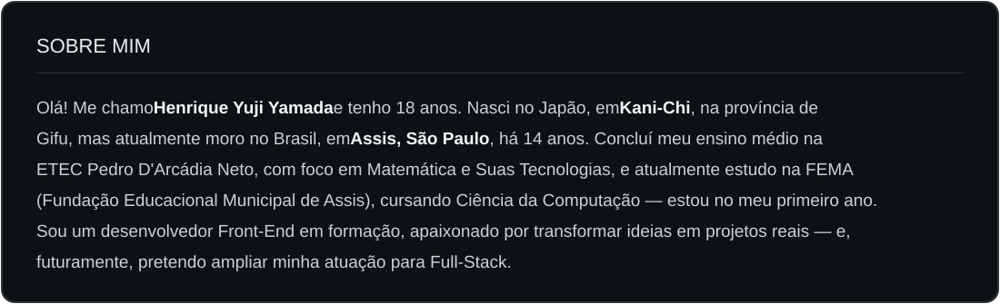
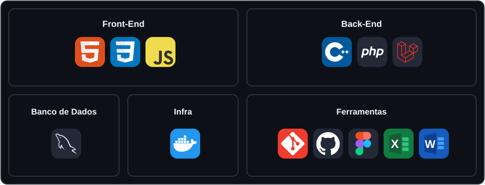
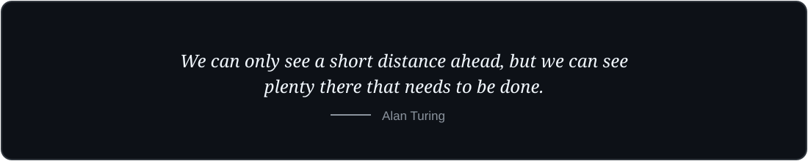

 

<h2>SKILLS</h2>

  

## PROJETOS EM DESTAQUE

  
  &nbsp;&nbsp;
  
  &nbsp;&nbsp;
  

 

## GITHUB STATS

  <picture>
    <source media="(prefers-color-scheme: dark)" srcset="https://github-profile-summary-cards.vercel.app/api/cards/stats?username=HenriqueYamada&theme=github_dark">
    <source media="(prefers-color-scheme: light)" srcset="https://github-profile-summary-cards.vercel.app/api/cards/stats?username=HenriqueYamada&theme=github">
    
  </picture>
  &nbsp;
  <picture>
    <source media="(prefers-color-scheme: dark)" srcset="https://github-profile-summary-cards.vercel.app/api/cards/repos-per-language?username=HenriqueYamada&theme=github_dark">
    <source media="(prefers-color-scheme: light)" srcset="https://github-profile-summary-cards.vercel.app/api/cards/repos-per-language?username=HenriqueYamada&theme=github">
    
  </picture>

## CONTRIBUTION SNAKE

  <picture>
    <source media="(prefers-color-scheme: dark)" srcset="https://raw.githubusercontent.com/HenriqueYamada/HenriqueYamada/output/github-contribution-grid-snake-dark.svg">
    <source media="(prefers-color-scheme: light)" srcset="https://raw.githubusercontent.com/HenriqueYamada/HenriqueYamada/output/github-contribution-grid-snake.svg">
    
  </picture>

  

  

## CONTATOS

  
Se quiser conversar sobre projetos, trocar ideias ou conhecer possíveis oportunidades, fique à vontade para entrar em contato.

   
  
  &nbsp;&nbsp;
  
  &nbsp;&nbsp;
  

