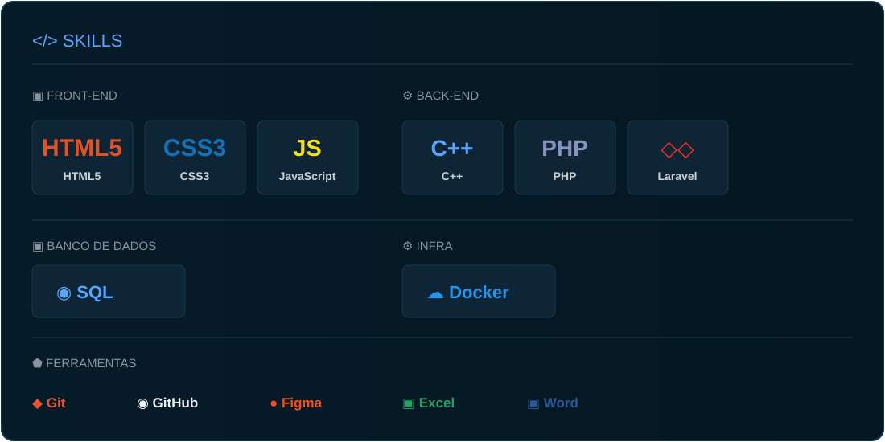

  

 

 

## 📁 PROJETOS EM DESTAQUE

  
  
  

 

## 🐙 GITHUB STATS

  <picture>
    <source media="(prefers-color-scheme: dark)" srcset="https://github-profile-summary-cards.vercel.app/api/cards/stats?username=HenriqueYamada&theme=github_dark">
    <source media="(prefers-color-scheme: light)" srcset="https://github-profile-summary-cards.vercel.app/api/cards/stats?username=HenriqueYamada&theme=github">
    
  </picture>
  <picture>
    <source media="(prefers-color-scheme: dark)" srcset="https://github-profile-summary-cards.vercel.app/api/cards/repos-per-language?username=HenriqueYamada&theme=github_dark">
    <source media="(prefers-color-scheme: light)" srcset="https://github-profile-summary-cards.vercel.app/api/cards/repos-per-language?username=HenriqueYamada&theme=github">
    
  </picture>
   
  
  

 

## 🐍 CONTRIBUTION SNAKE

  <picture>
    <source media="(prefers-color-scheme: dark)" srcset="https://raw.githubusercontent.com/HenriqueYamada/HenriqueYamada/output/github-contribution-grid-snake-dark.svg">
    <source media="(prefers-color-scheme: light)" srcset="https://raw.githubusercontent.com/HenriqueYamada/HenriqueYamada/output/github-contribution-grid-snake.svg">
    
  </picture>
   
  Contribuindo um commit de cada vez. 🐍

 

  

 

## 📡 CONTATOS

  
  
  

