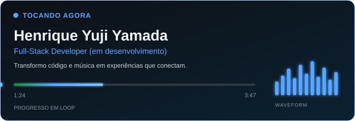

<table width="100%">
  <tr>
    <td width="72%" valign="middle">
      <picture>
        <source media="(prefers-color-scheme: dark)" srcset="./assets/now-playing-dark.svg">
        <source media="(prefers-color-scheme: light)" srcset="./assets/now-playing-light.svg">
        
      </picture>
    </td>
    <td width="28%" align="center" valign="middle">
      
    </td>
  </tr>
  <tr>
    <td colspan="2" align="center">
      <h3>⏮️ &nbsp;&nbsp; ⏸️ &nbsp;&nbsp; ⏭️ &nbsp;&nbsp;&nbsp;&nbsp; 🔀 &nbsp;&nbsp; 🔁</h3>
      Os controles são apenas visuais e não são clicáveis.
    </td>
  </tr>
</table>

 

## 👤 SOBRE MIM

<table width="100%">
  <tr>
    <td>
      Olá! Me chamo Henrique Yuji Yamada e tenho 18 anos. Nasci no Japão, em Kani-Chi, na província de Gifu, mas atualmente moro no Brasil, em Assis, São Paulo, há 14 anos. Concluí meu ensino médio na ETEC Pedro D'Arcádia Neto, com foco em Matemática e Suas Tecnologias, e atualmente estudo na FEMA (Fundação Educacional Municipal de Assis), cursando Ciência da Computação — estou no meu primeiro ano. Sou um desenvolvedor Front-End em formação, apaixonado por transformar ideias em projetos reais — e, futuramente, pretendo ampliar minha atuação para Full-Stack.
    </td>
  </tr>
</table>

 

## `</>` SKILLS

<table width="100%">
  <tr>
    <td width="50%" valign="top">
      <strong>🎨 Front-End</strong>  
      
      
      
    </td>
    <td width="50%" valign="top">
      <strong>⚙️ Back-End</strong>  
      
      
      
    </td>
  </tr>
  <tr>
    <td valign="top"><strong>🗄️ Banco de Dados</strong>  </td>
    <td valign="top"><strong>🐳 Infra</strong>  </td>
  </tr>
  <tr>
    <td colspan="2" valign="top">
      <strong>🧰 Ferramentas</strong>  
      
      
      
      
      
    </td>
  </tr>
</table>

 

## 📁 PROJETOS EM DESTAQUE

<table width="100%">
  <tr>
    <td width="33%" valign="top"><h3>🎸 FHD Music</h3>
Site institucional de uma escola de música com foco em experiência e informação.
<a href="https://github.com/HenriqueYamada/Projeto-FHD-Music">▶ Ver projeto</a></td>
    <td width="33%" valign="top"><h3>💌 Cartas Discersadas</h3>
Projeto pessoal de cartas anônimas com mensagens sinceras e aleatórias.
<em>Link em breve</em></td>
    <td width="33%" valign="top"><h3>🗺️ Jornada Viagens</h3>
Plataforma para compartilhar e descobrir experiências de viagem.
<em>Link em breve</em></td>
  </tr>
</table>

 

## 🐙 GITHUB STATS

  <picture>
    <source media="(prefers-color-scheme: dark)" srcset="https://github-profile-summary-cards.vercel.app/api/cards/profile-details?username=HenriqueYamada&theme=github_dark">
    <source media="(prefers-color-scheme: light)" srcset="https://github-profile-summary-cards.vercel.app/api/cards/profile-details?username=HenriqueYamada&theme=github">
    
  </picture>
   
  <picture>
    <source media="(prefers-color-scheme: dark)" srcset="https://github-profile-summary-cards.vercel.app/api/cards/stats?username=HenriqueYamada&theme=github_dark">
    <source media="(prefers-color-scheme: light)" srcset="https://github-profile-summary-cards.vercel.app/api/cards/stats?username=HenriqueYamada&theme=github">
    
  </picture>
  <picture>
    <source media="(prefers-color-scheme: dark)" srcset="https://github-profile-summary-cards.vercel.app/api/cards/repos-per-language?username=HenriqueYamada&theme=github_dark">
    <source media="(prefers-color-scheme: light)" srcset="https://github-profile-summary-cards.vercel.app/api/cards/repos-per-language?username=HenriqueYamada&theme=github">
    
  </picture>
   
  
  

 

## 🐍 CONTRIBUTION SNAKE

  <picture>
    <source media="(prefers-color-scheme: dark)" srcset="https://raw.githubusercontent.com/HenriqueYamada/HenriqueYamada/output/github-contribution-grid-snake-dark.svg">
    <source media="(prefers-color-scheme: light)" srcset="https://raw.githubusercontent.com/HenriqueYamada/HenriqueYamada/output/github-contribution-grid-snake.svg">
    
  </picture>

Gerada automaticamente todos os dias pelo workflow já existente com Platane/snk.

 

## 💬 CITAÇÃO FILOSÓFICA

<table width="100%"><tr><td align="center"><h3>“O que você faz hoje pode melhorar todos os seus amanhãs.”</h3>— Ralph Marston</td></tr></table>

 

## 📡 CONTATOS

